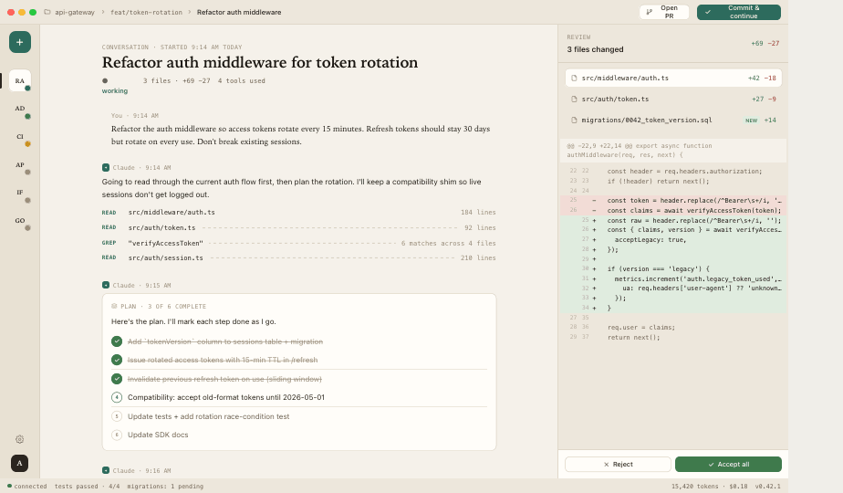

# Claude Workbench

A native desktop app for running [Claude Code](https://docs.anthropic.com/en/docs/claude-code) as a persistent, multi-session agent — built with Tauri 2, React, and Rust.



## What it does

- **Multiple concurrent sessions** — run Claude against several projects simultaneously, each with its own conversation, file diff, and terminal
- **Session rail** — live status per session: what tool is running, streaming indicator, working/review/awaiting states
- **Right-side panel** — file browser, diff viewer, and inline file editor
- **Terminal** — integrated PTY terminal per session
- **Automations** — saved prompts that can be run on demand against any project
- **Token usage footer** — context window %, input/output/cache counts per session

## Requirements

- macOS 13+ (Tauri 2 / WebKit)
- [Claude Code CLI](https://docs.anthropic.com/en/docs/claude-code) installed and authenticated (`npm install -g @anthropic-ai/claude-code` then `claude`)
- Rust toolchain (`rustup`) + Node.js 18+

## Build

```bash
# Install JS dependencies
npm install

# Run in development
npm run tauri dev

# Build a release app bundle
npm run tauri build
```

## Known limitations

This is an early-stage release. Several features are stubbed or in progress:

- **Permission gating is not yet enforced.** Claude runs with `--dangerously-skip-permissions` — the permission UI (banners and modals) is wired but does not currently block tool calls. Do not run against sensitive codebases without reviewing Claude's actions.
- **Search** is not yet implemented.
- **Settings** — only Account and Appearance panes are functional. Other sections are coming.
- **⌘N** opens a new chat. **⌘J** toggles the terminal panel. **⌘T** opens a new terminal tab.

## Data stored locally

All data is stored in `~/.workbench/`:

| File | Contents |
|---|---|
| `profile.json` | Project list, layout preferences |
| `sessions.json` | Conversation history, diffs, terminal state |
| `automations.json` | Saved automation prompts |

## License

MIT — see [LICENSE](LICENSE).
